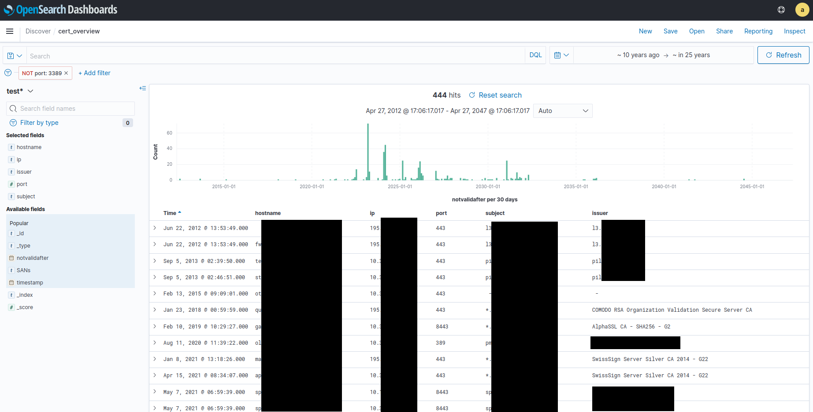
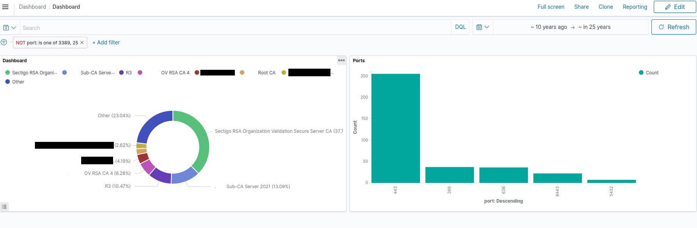
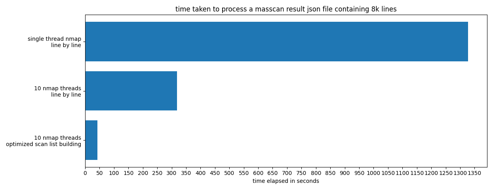
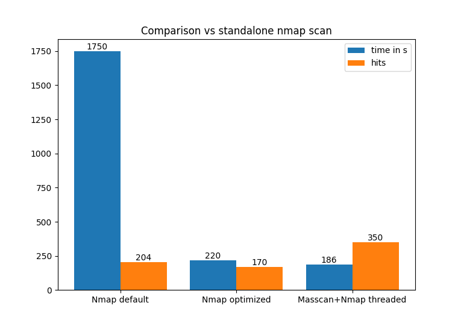

# SSL Certificate Inventory (POC)

This is a proof of concept on how to inventorize used SSL Certificates for example in an enterprise environment. The idea was to
use  [masscan](https://github.com/robertdavidgraham/masscan) as the primary network scanner utilizing its huge speed advantage over Nmap and importing the results into an Elasticsearch-Kibana/Opensearch Stack for exploring and generating alerts.  

However, there are some **limitations** to that: 
1. Masscan has limited support for [grabbing](https://github.com/robertdavidgraham/masscan#banner-checking) the SSL Certificate from services other than HTTPS/SMTP/IMAP.
2. Masscan uses a **hardcoded** TLS 1.1 "Client Hello" packet (see [here](https://github.com/robertdavidgraham/masscan/blob/144c527ed55275ee9fbb80bb14fbb5e3fcff3b7e/src/proto-ssl.c#L1059)). This leads to problems retrieving the SSL Certificate from servers not supporting TLS 1.1, which is deprecated [since March 2021](https://datatracker.ietf.org/doc/rfc8996/).
3. Masscan might not be available on the users' system.

To combat these limitations I implemented several ways for importing and generating scan results. This includes multi threading nmap and using [Nmap's SSL Cert Script](https://nmap.org/nsedoc/scripts/ssl-cert.html) to extract the certificates from the hosts masscan detected.

I also compiled my own masscan binary, replacing the TLS 1.1 packet with TLS 1.2, as this increased coverage and reduced connection errors significantly when grabbing for Certificates. The binary is included in this repo. Compiling your own TLS 1.2 masscan version is as easy as capturing a TLS 1.2 handshake (e.g. ``curl --tlsv1.2 https://10.X.X.X``   ) with wireshark and inserting the packet [here](https://github.com/robertdavidgraham/masscan/blob/144c527ed55275ee9fbb80bb14fbb5e3fcff3b7e/src/proto-ssl.c#L1059).
# Setup and configuration
The project can be run using the included docker-compose file. This sets up an opensearch cluster aswell as elastalert for [alerting](#alerting). 
You may need to run following command beforehand:
```shell
# https://stackoverflow.com/questions/51445846/elasticsearch-max-virtual-memory-areas-vm-max-map-count-65530-is-too-low-inc
sysctl -w vm.max_map_count=262144
```

The connection parameters to the desired elasticsearch/opensearch cluster are set inside the [main.py](main.py) file and are preset to work with the docker-compose environment.
If you wish to use elasticsearch, comment in the [elasticsearch config](https://github.com/SysAdmLS/ssl-inventory/blob/35c0b1255ea0a99ae18df2eeb1963b8e9fc24194/main.py#L20) and the corresponding index functions ([1](https://github.com/SysAdmLS/ssl-inventory/blob/35c0b1255ea0a99ae18df2eeb1963b8e9fc24194/main.py#L86),[2](https://github.com/SysAdmLS/ssl-inventory/blob/35c0b1255ea0a99ae18df2eeb1963b8e9fc24194/main.py#L130)).  

For [alerting](#alerting) to work edit [certexpire.yaml](rules/certexpire.yaml) and enter your smtp server/credential as well as email address.

# Usage
The first step is to use masscan to generate some scan results of the desired network. For an explanation of the parameters used please consult the [masscan docs](https://github.com/robertdavidgraham/masscan/blob/master/README.md).

```
./masscan 10.32.0.0/16 --top-ports --rate 500000 --source-ip 10.144.1.12 --banners -oJ test.json

```
Now there is different ways to handle the masscan output in [main.py](main.py).
```python
# RECOMMENDED
# parse masscan result and pass these to 10 nmap threads for better certificate extraction
# import to test index
ScanresultNmap('test').masscantonmap_threaded('test.json', 10)

# look for grabbed ssl banners in the output file from masscan and import to "test" index
# semi recommended, see limitations above
ScanresultMasscan('test.json', 'test')

# NOT RECOMMENDED: passing the found hosts and ports to single thread nmap with ssl-cert script
ScanresultNmap('test').masscantonmap('test.json')
```
There is also the possibility to generate a nmap scan report using:

``nmap --top-ports 1000  10.32.0.0/16 -oX test.xml --script ssl-cert --script-timeout 10``

and then parsing this with:
```python
# parse nmap scan report and import to test index
ScanresultNmap('test').parsefromfile('test.xml')
```
Although I advise not to use this way, as this is a rather slow and inaccurate process, see [Performance](#performance).

The indexed data can now be viewed under http://localhost:5601 using admin:admin to login.

All that's left to do is creating an index pattern under Stack Management => Index patterns => Create index pattern and select _notvalidafter_ as the time field.

Now we can discover the indexed data with a nice timeline showing us when certificates are about to expire.


Or create dashboards visualizing our data:

# Alerting
For alerting this project uses https://github.com/jertel/elastalert2 which provides a feature rich rule set and many connectors to platforms that can be used to receive the alerts.

The example rule file [certexpire.yaml](rules/certexpire.yaml) contains the settings for a simple email notification when it detects a certificate expiring in the next 60 days.

Keep in mind that this rule filters out data older than 5 days aswell as the RDP Port (3389) and the SMTP Port (25) as these are mostly self signed certificates auto generated by services.

More informations on the settings used can be found here: https://elastalert2.readthedocs.io/en/latest/
# Performance
To measure performance and show how threading and code optimization can improve runtime I tested several version of this project while developing it. 

**Every test was run on the same /16 subnet for the top 1000 ports.**

My first version parsed the masscan results line by line and rescanned every result with a single nmap instance. After that I implemented multi threading because nmap does not support that natively. In the last and final version nmap is fed a precomputed list instead of single lines from the masscan results (masscan outputs one host/port combination per line). 

This cut down the time needed significantly from 1327 seconds to only 42 seconds as seen in the following chart.



Comparing the method of using masscan to prescan the network and then using nmap to do the certificate extraction vs solely using nmap yielded some interesting results. Not only was it way faster but also increased the detection rate of hosts, services and certificates. 

It seems that nmap has problems scanning large subnets in combination with the ssl-script. This result could be replicated over several runs although I did not investigate the cause of this.



For the optimized nmap run the following flags were used:
- -T5 (aggressive timing https://nmap.org/book/performance-timing-templates.html)
- --min-parallelism 100 (https://nmap.org/book/man-performance.html)
# Conclusion
- Using masscan to generate a scanlist and feeding that into threaded nmap instances does not only run faster but also yields way more accurate results
- Elasticsearch/Opensearch provides a quick and easy way to query and index data for discovery and visualization compared to conventional database systems 
- Scanning your whole network does not have to take long and is a practicable way of keeping up with changes that would go unnoticed otherwise
- Opensource rocks